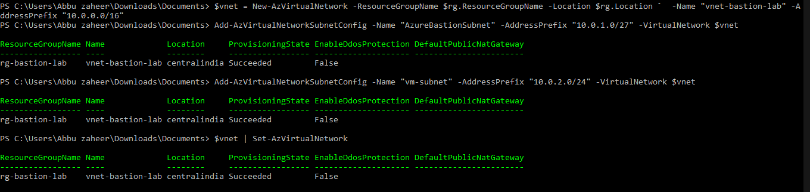
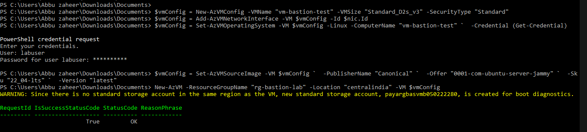
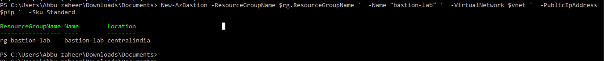
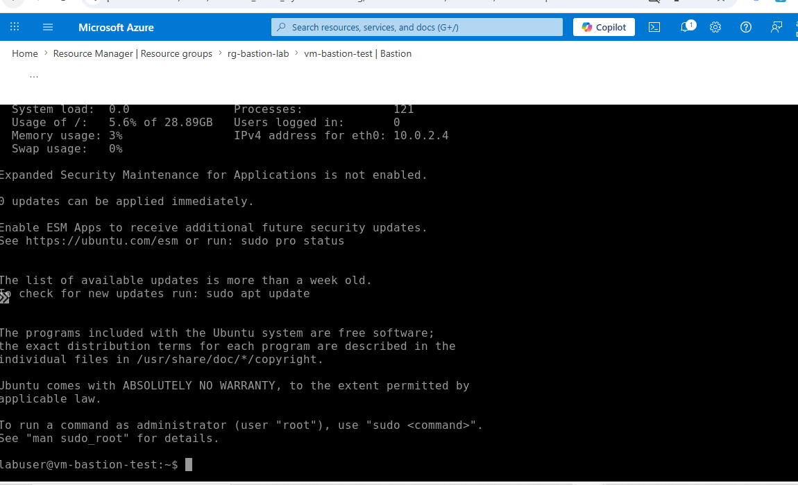

# Lab 8: Azure Bastion

## 🎯 Objective
Deploy Azure Bastion to securely connect to virtual machines using RDP/SSH directly from the Azure portal, without requiring public IP addresses or open ports.

---

## ⚙️ Resources Deployed
| Resource Type | Name | Purpose |
|---|---|---|
| Resource Group | rg-bastion-lab | Logical container for Bastion lab resources |
| Virtual Network | vnet-bastion-lab | Hosts Bastion and VM subnets |
| Bastion Subnet | AzureBastionSubnet | Reserved subnet required for Azure Bastion |
| VM Subnet | vm-subnet | Subnet used for VM deployment |
| Virtual Machine | vm-bastion-test | Ubuntu 22.04 VM used for Bastion connectivity |
| Bastion Host | bastion-lab | Secure browser-based SSH/RDP access |
| Public IP | bastion-pip | Static Standard SKU public IP for Bastion |

## 🌍 Deployment Scope
- Deployed Azure Bastion for secure browser-based SSH access.
- Configured segmented virtual network architecture using dedicated Bastion and workload subnets.
- Provisioned Ubuntu 22.04 VM without exposing a public IP address.
- Implemented Bastion Standard SKU with static public IP integration.
- Validated secure remote administration through Azure Portal.
- Troubleshot subnet restrictions and Trusted Launch feature registration issues.

---

## 🛠️ Deployment Workflow & Troubleshooting

### 1️⃣ Resource Group Provisioning
Created resource group `rg-bastion-lab` in **Central India**.  

---

### 2️⃣ Virtual Network and Subnet Configuration
Provisioned `vnet-bastion-lab` with:  
- `AzureBastionSubnet` (10.0.1.0/27) → reserved for Bastion  
- `vm-subnet` (10.0.2.0/24) → used for VM deployment  

---

### 3️⃣ Ubuntu VM Deployment and Troubleshooting
- Initial VM deployment failed because AzureBastionSubnet cannot host workload resources.
- Resolved by creating a dedicated workload subnet named `vm-subnet`.
- Encountered Trusted Launch feature registration issue during VM deployment.
- Registered required Microsoft.Compute preview features:
  - `UseStandardSecurityType`
  - `StandardSecurityTypeAsFirstClassEnum`
 
- Successfully redeployed VM using `SecurityType = Standard`.
     

Final deployment succeeded with `securityType = Standard`.  

---

### 4️⃣ Azure Bastion Host Deployment
- Created Standard SKU static public IP (`bastion-pip`).  
- Deployed Bastion host `bastion-lab` linked to VNet and Public IP.  
- Resolved Bastion deployment parameter mismatch by passing the complete Public IP object instead of only the resource ID.

---

### 5️⃣ Secure SSH Connectivity Validation
Connected to `vm-bastion-test` directly from Azure Portal using Bastion.  
No public IP required, session opened securely in browser.  

## 📊 Operational Validation
 
- Successfully provisioned Azure Bastion using Standard SKU architecture.
- Verified dedicated subnet segmentation between Bastion and workload resources.
- Confirmed secure SSH access to `vm-bastion-test` directly from Azure Portal.
- Validated that no public IP was attached to the virtual machine.
- Successfully resolved Trusted Launch feature registration dependency.
- Confirmed Bastion browser-based session functionality without opening inbound ports.
- Verified secure administrative access aligned with Azure security best practices.

---

## 📚 Key Learnings
- How to deploy and configure Azure Bastion for secure VM access.
- Importance of dedicated subnet design using `AzureBastionSubnet`.
- How to securely access Azure VMs without exposing public IP addresses.
- Understanding Bastion Standard SKU deployment requirements.
- Troubleshooting subnet deployment restrictions and parameter mismatches.
- Handling Trusted Launch and Microsoft.Compute feature registration dependencies.
- Validating secure browser-based SSH connectivity through Azure Portal.

## 📌 Resume Alignment
- Deployed Azure Bastion to enable secure browser-based SSH access without exposing public IP addresses.
- Configured segmented Azure networking architecture with dedicated Bastion and workload subnets.
- Troubleshot and resolved Azure VM deployment issues related to subnet restrictions and Trusted Launch registration.
- Implemented secure remote administration aligned with Azure cloud security best practices.
- Validated Bastion connectivity and hardened VM access by eliminating inbound management port exposure.
