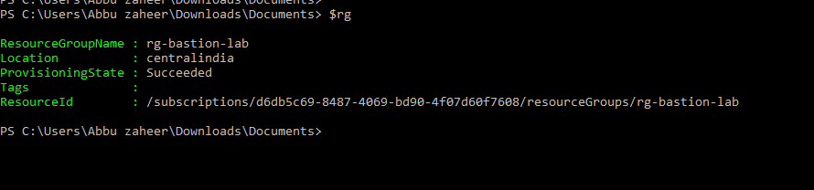
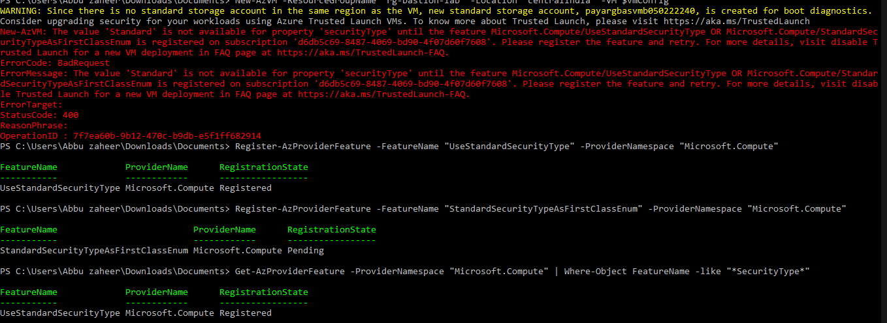

# Lab 8: Azure Bastion

## 🎯 Objective
Deploy Azure Bastion to securely connect to virtual machines using RDP/SSH directly from the Azure portal, without requiring public IP addresses or open ports.

---

## ⚙️ Resources Deployed
- **Resource Group**: rg-bastion-lab  
- **Virtual Network**: vnet-bastion-lab  
- **Subnets**:  
  - AzureBastionSubnet (required name, reserved for Bastion)  
  - vm-subnet (for VM deployment)  
- **Virtual Machine**: vm-bastion-test (Ubuntu 22.04, Trusted Launch enabled)  
- **Bastion Host**: bastion-lab (Standard SKU, static public IP)

---

## 🛠️ Deployment Flow & Troubleshooting

### 1️⃣ Resource Group Creation
Created resource group `rg-bastion-lab` in **Central India**.  

---

### 2️⃣ Virtual Network & Subnets
Provisioned `vnet-bastion-lab` with:  
- `AzureBastionSubnet` (10.0.1.0/27) → reserved for Bastion  
- `vm-subnet` (10.0.2.0/24) → used for VM deployment  

---

### 3️⃣ VM Deployment (Ubuntu 22.04)
- Initially hit errors trying to deploy VM into `AzureBastionSubnet` (not allowed).  
- Fixed by creating `vm-subnet` and attaching NIC to it.  
- Encountered Trusted Launch error → resolved by registering features:  
  - `UseStandardSecurityType`  
  - `StandardSecurityTypeAsFirstClassEnum`
     

Final deployment succeeded with `securityType = Standard`.  

---

### 4️⃣ Bastion Host Creation
- Created Standard SKU static public IP (`bastion-pip`).  
- Deployed Bastion host `bastion-lab` linked to VNet and Public IP.  
- Fixed error by passing **Public IP object** instead of `.Id`.  

---

### 5️⃣ Secure SSH via Bastion
Connected to `vm-bastion-test` directly from Azure Portal using Bastion.  
No public IP required, session opened securely in browser.  

---

## 📚 Key Learnings & Resume Highlights
- Deployed Azure Bastion to enable secure RDP/SSH without public IPs.  
- Configured required `AzureBastionSubnet` and created separate `vm-subnet` for VM.  
- Resolved multiple errors: subnet misuse, parameter mismatch, Trusted Launch registration.  
- Demonstrated secure connectivity aligned with best practices for cloud security.  
- Strengthened BCDR and compliance posture by eliminating exposed ports.  
